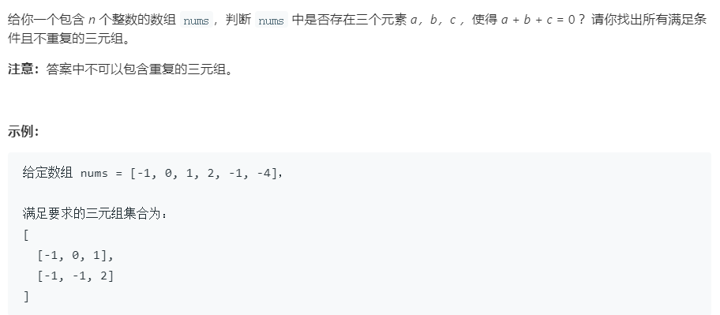

### 思路：

因为要求找三元组：a+b+c = 0，暴力求解的话复杂度为O(n^3)，太高，根据题意，b+c = -a，可以转换为求TwoSum，遍历给定的数组，将当前的数组元素作为目标值target，从剩下的数中找出b和c。去除重复就利用集合这种数据结构。

### 我的代码：

```java
public static List<List<Integer>> threeSum(int[] nums) {
        int a, b, c;
        List<List<Integer>> ret = new ArrayList<>();
        Set<String> check = new HashSet<>();


        for ( int i=0; i<nums.length; i++){
            int target = -nums[i];
            HashMap<Integer, Integer> num = new HashMap<>();
            for ( int j=i+1; j<nums.length; j++){
                if (num.containsKey(target-nums[j])){
                    a = nums[i];
                    b = nums[j];
                    c = target-nums[j];

                    List<Integer> tuple = new ArrayList<>();

                    if (a > b){
                        if (a > c){
                            if (b > c){
                                tuple.add(c);
                                tuple.add(b);
                                tuple.add(a);
                            } else{
                                tuple.add(b);
                                tuple.add(c);
                                tuple.add(a);
                            }
                        } else{
                            tuple.add(b);
                            tuple.add(a);
                            tuple.add(c);
                        }
                    } else{
                        if (a > c) {
                            tuple.add(c);
                            tuple.add(a);
                            tuple.add(b);
                        } else{
                            if (b > c){
                                tuple.add(a);
                                tuple.add(c);
                                tuple.add(b);
                            } else{
                                tuple.add(a);
                                tuple.add(b);
                                tuple.add(c);
                            }
                        }
                    }
                    String s = tuple.get(0)+""+tuple.get(1)+""+tuple.get(2);
                    if (!check.contains(s)){
                        check.add(s);
                        ret.add(tuple);
                    }
                }
                num.put(nums[j], j);
            }
        }

        return ret;
    }
```

### 别人的思路

双指针的思想：因为一般的解法是三重循环遍历数组，这样的时间复杂度为
$$
O(N^3)
$$
我们发现，因为题意为
$$
a+b+c=0
$$
当第二重循环往后遍历元素`b'`时，因为`b'`比`b`大，所以`c'`一定比`c`要小才能满足题意，所以可以在遍历`b`的同时遍历`c`，这样就把三重循环的问题转换为了两重循环。

还有就是去除重复的问题，出现重复的原因就是相同元素出现的顺序不一样，那么我们事先对数组进行一个排序就可以了，之后在遍历的时候注意在同一重循环之下，相同的元素只遍历一次即可。

```java
public static List<List<Integer>> threeSum(int[] nums){
        int n = nums.length;
        Arrays.sort(nums);
        List<List<Integer>> ans = new ArrayList<List<Integer>>();
        // 枚举 a
        for (int first = 0; first < n; ++first) {
            // 需要和上一次枚举的数不相同
            if (first > 0 && nums[first] == nums[first - 1]) {
                continue;
            }
            // c 对应的指针初始指向数组的最右端
            int third = n - 1;
            int target = -nums[first];
            // 枚举 b
            for (int second = first + 1; second < n; ++second) {
                // 需要和上一次枚举的数不相同
                if (second > first + 1 && nums[second] == nums[second - 1]) {
                    continue;
                }
                // 需要保证 b 的指针在 c 的指针的左侧
                while (second < third && nums[second] + nums[third] > target) {
                    --third;
                }
                // 如果指针重合，随着 b 后续的增加
                // 就不会有满足 a+b+c=0 并且 b<c 的 c 了，可以退出循环
                if (second == third) {
                    break;
                }
                if (nums[second] + nums[third] == target) {
                    List<Integer> list = new ArrayList<Integer>();
                    list.add(nums[first]);
                    list.add(nums[second]);
                    list.add(nums[third]);
                    ans.add(list);
                }
            }
        }
        return ans;
 }
```

