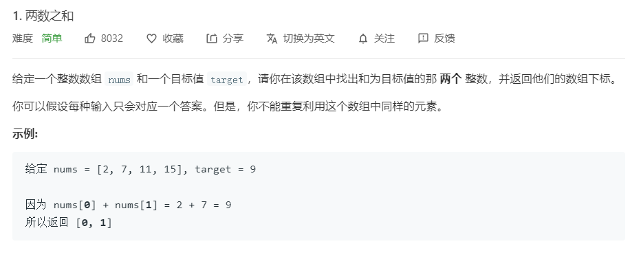

### 思路：

遍历给定的数组，使用target值减去当前的元素，在剩下的数组中寻找。

### 我的代码：

```java
public int[] twoSum(int[] nums, int target) {
        int[] ret = new int[2];

        for ( int i=0; i<nums.length; i++){
            int gap = target - nums[i];
            for (int j=i+1; j<nums.length; j++){
                if (nums[j] == gap){
                    ret[0] = i;
                    ret[1] = j;
                    break;
                }
            }
        }

        return ret;
    }
```

时间复杂度不太乐观，为O(n^2)级别，这是最简单的解法。

### 别人的代码

```java
public int[] twoSum(int[] nums, int target) {

        HashMap<Integer, Integer> record = new HashMap<Integer, Integer>();
        for(int i = 0 ; i < nums.length; i ++){

            int complement = target - nums[i];
            if(record.containsKey(complement)){
                int[] res = {i, record.get(complement)};
                return res;
            }
            record.put(nums[i], i);
        }
        throw new IllegalStateException("the input has no solution");
    }
}
```

使用了映射这种数据结构，在扫描的同时对数据进行插入，时间复杂度缩小到O(n)。