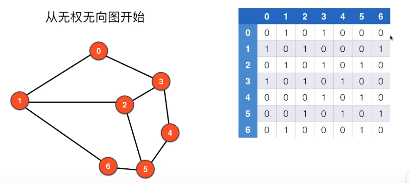

### 图论的应用

- 地理路线。
- 路由路线。
- 互联网连接。
- 论文引用。
- 社交网络。
- 规划方面的应用。

图论是离散数学的一个分支。

### 图的表示

#### 图的分类

图包括**顶点（Vertex）**，**边（Edge）。**

**无向图（Undirected Graph）**，**有向图（Directed Graph）**。

**无权图**，**有权图**。

所以可以分为四类：<u>无向无权图、有向无权图、无向有权图、有向有权图。</u>

#### 图的基本概念（无向无权图）

- *两点相邻*。如果两个点有边相邻，就说这两点相邻。
- *点的邻边*。和这个点相连的所有边。
- *路径Path*。从这张图上的边，可以从一个顶点到达另外一个顶点。
- *环Loop*。从一个点经过多条边又回到这个点，就说环。
- *自环边*。从这个点到这个点。
- *平行边*。可能有时候两个顶点间有两条边。
- *简单图*：没有自环边和平行边的图我们称为简单图。
- *连通分量*：一张图中相互连接，可以互相到达的顶点的集合称为连通分量。一张图不一定所有的顶点都相邻。一个图可能有多个连通分量。
- *有环图，无环图*（树是一种无环图）。
- *连通图的生成树*（包含所有的顶点的树），边数是V-1。只有连通图才有生成树。一个图一定有生成森林。
- *一个顶点的度*（degree）：这个顶点相邻的边数。

#### 图的基本表示：邻接矩阵



设邻接矩阵为A，则`A[i][j] = 1`表示顶点i和顶点j相邻。对于简单图（无自环边和平行边），对于无向图，邻接矩阵沿着主对角线对称。

图的数据表示：（以某一文件格式为例）


第一行第一个数表示顶点数，第二个数表示边的数目，后面的每一行代表一条边。我们需要做的是，读入数据，之后，翻译为邻接矩阵。

```java
File file = new File(fileName);
// 捕获异常
// java7语法，会自动关闭资源
try (Scanner scanner = new Scanner(file)) {
    // 读入顶点数
    V = scanner.nextInt();
    // 对数据的合法性做一个判断
    if (V < 0){
    	throw new IllegalArgumentException("The value of Vertex must be non-negative!");
    }

    // 创建二维数组
    adj = new int[V][V];
    // 读入边数
    E = scanner.nextInt();
    if (V < 0){
        throw new IllegalArgumentException("The value of Edge must be non-negative!");
    }
    // 循环读入每一条边
    for (int i=0; i<E; i++)
    {
        int a = scanner.nextInt();
        validateVertex(a);
        int b = scanner.nextInt();
        validateVertex(b);

        // 检测自环边和平行边
        if (a == b){
            throw new IllegalArgumentException("Self Loop is detective!");
        }
        if (adj[a][b] == 1){
            throw new IllegalArgumentException("Parallel Edge is detective!");
        }

        adj[a][b] = 1;
        adj[b][a] = 1;
     }
}
catch (IOException e) {
            e.printStackTrace();
}
```

对于一个图来说，我们需要以下的几个方法：

```java
	// 获取顶点数
    public int getV(){
        return V;
    }

    // 获取边数
    public int getE(){
        return E;
    }

    // 查看图中是否存在边
    public boolean hasEdge(int a, int b){
        validateVertex(a);
        validateVertex(b);

        return adj[a][b] == 1;
    }

    // 返回和一个顶点相邻的其他顶点
    public ArrayList<Integer> adj(int v){
        validateVertex(v);
        ArrayList<Integer> res = new ArrayList<>();
        for (int i=0; i<V; i++){
            if (adj[v][i] == 1){
                res.add(i);
            }
        }

        return res;
    }

    // 求一个顶点的度
    public int degree(int v){
        return adj(v).size();
    }
```

可以，我们使用邻接矩阵方法来表示图本质就是使用一个二维数组来表示图。来分析一下这种表示方法的空间复杂度和时间复杂度。空间复杂度，很容易，因为我们使用了二维数组来进行图的存储，所以为`O(V^2)`。对于时间复杂度来说：建图的过程时间复杂度为`O(E)`，查看两点是否相邻这个方法时间复杂度为`O(1)`，求一个点的相邻节点这个方法时间复杂度为`O(V)`。通过上述分析，我们可以看出，邻接矩阵这种表示方法耗费的空间太恐怖了，对于稀疏图来说，邻接矩阵几乎都是0，大大浪费了存储空间。大多数情况下，我们处理的都是稀疏图。对于稀疏图和稠密图没有一个固定的概念标准。

#### 图的基本表示：邻接表

