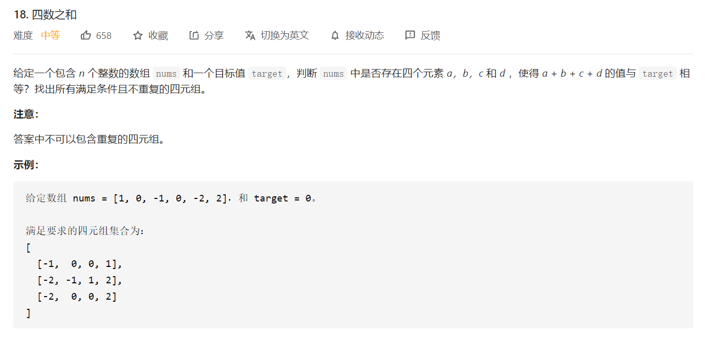

想了一会儿没想出好办法来，只想到了暴力破解...

~~忽然想到了，可以先对数组进行排序，排序之后四个数四个数地取了相加即可。~~

想的都是些啥......，首先对数组进行排序，是为了避免重复，之后使用和ThreeSum解法相同的双指针思想，降低复杂度，在具体执行的时候根据情况进行相应的剪枝：

- 在确定了第一个数之后，如果前四个数相加大于target，就可以退出第一重循环了，因为后面剩下三个数再往后取都只会更大。
- 在确定了第一个数之后，如果第一个数和倒数后三个数相加小于target，可以直接进入下一轮，遍历后一个“第一个数”。
- 在确定了前两个数之后，`nums[i]`和`nums[j]`，如果`nums[i]+nums[j]+nums[j+1]+nums[j+2]>target`，可以退出第二重循环。
- 在确定了前两个数之后，`nums[i]`和`nums[j]`，如果`nums[i]+nums[j]+nums[n-2]+nums[n-1]<target`，可以以直接进入下一轮，遍历`nums[j+1]`。

```java
public List<List<Integer>> fourSum(int[] nums, int target) {

        List<List<Integer>> result = new ArrayList<>();

        if (nums == null || nums.length < 4){
            return result;
        }

        // 排序
        Arrays.sort(nums);

        int len = nums.length;

        // 维护存储已经遍历过的元素的集合，防止遍历相同的元素
        Set<Integer> listA = new HashSet<>();
        Set<Integer> listB;
        Set<Integer> listC;

        A:for (int a=0; a<len-3; a++){

            // 剪枝
            if (nums[a] + nums[a+1] + nums[a+2] + nums[a+3] > target) {
                break;
            }

            if (nums[a] + nums[len-1] + nums[len-2] + nums[len-3] < target) {
                continue;
            }

            // 如果是相同的元素，跳过
            if (listA.contains(nums[a])){
                continue;
            }
            else{
                listA.add(nums[a]);
            }

            listB = new HashSet<>();

            B:for (int b=a+1; b<len-2; b++){

                // 剪枝
                if (nums[a] + nums[b] + nums[b+1] + nums[b+2] > target){
                    break;
                }

                if (nums[a] + nums[b] + nums[len-1] + nums[len-2] < target){
                    continue;
                }

                // 如果是相同的元素，跳过
                if (listB.contains(nums[b])){
                    continue;
                }
                else{
                    listB.add(nums[b]);
                }

                listC = new HashSet<>();

                // 第四个数的指针
                int d = len-1;

                C:for (int c=b+1; c<len-1; c++){

                    // 如果是相同的元素，跳过
                    if (listC.contains(nums[c])){
                        continue;
                    }
                    else{
                        listC.add(nums[c]);
                    }

                    // 保证c指针在d指针的左边
                    while (c < d && nums[a] + nums[b] + nums[c] + nums[d] > target){
                        d--;
                    }

                    // 两个指针重合时，继续遍历
                    if (c == d){
                        break;
                    }

                    // 满足条件
                    if (nums[a] + nums[b] + nums[c] + nums[d] == target){
                        List<Integer> solution = new ArrayList<>();
                        solution.add(nums[a]);
                        solution.add(nums[b]);
                        solution.add(nums[c]);
                        solution.add(nums[d]);
                        result.add(solution);
                    }
                }

            }
        }

        return result;
    }
```

