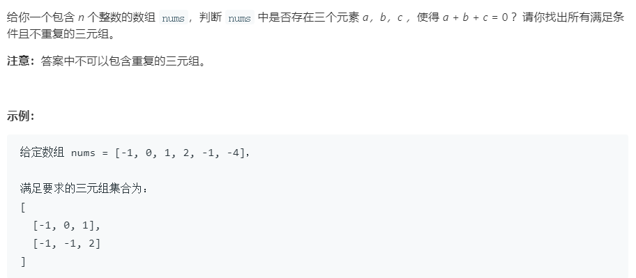

### 思路：

因为要求找三元组：a+b+c = 0，暴力求解的话复杂度为O(n^3)，太高，根据题意，b+c = -a，可以转换为求TwoSum，遍历给定的数组，将当前的数组元素作为目标值target，从剩下的数中找出b和c。

### 我的代码：

```java
public static List<List<Integer>> threeSum(int[] nums) {
        int a, b, c;
        List<List<Integer>> ret = new ArrayList<>();
        Set<String> check = new HashSet<>();


        for ( int i=0; i<nums.length; i++){
            int target = -nums[i];
            HashMap<Integer, Integer> num = new HashMap<>();
            for ( int j=i+1; j<nums.length; j++){
                if (num.containsKey(target-nums[j])){
                    a = nums[i];
                    b = nums[j];
                    c = target-nums[j];

                    List<Integer> tuple = new ArrayList<>();

                    if (a > b){
                        if (a > c){
                            if (b > c){
                                tuple.add(c);
                                tuple.add(b);
                                tuple.add(a);
                            } else{
                                tuple.add(b);
                                tuple.add(c);
                                tuple.add(a);
                            }
                        } else{
                            tuple.add(b);
                            tuple.add(a);
                            tuple.add(c);
                        }
                    } else{
                        if (a > c) {
                            tuple.add(c);
                            tuple.add(a);
                            tuple.add(b);
                        } else{
                            if (b > c){
                                tuple.add(a);
                                tuple.add(c);
                                tuple.add(b);
                            } else{
                                tuple.add(a);
                                tuple.add(b);
                                tuple.add(c);
                            }
                        }
                    }
                    String s = tuple.get(0)+""+tuple.get(1)+""+tuple.get(2);
                    if (!check.contains(s)){
                        check.add(s);
                        ret.add(tuple);
                    }
                }
                num.put(nums[j], j);
            }
        }

        return ret;
    }
```

