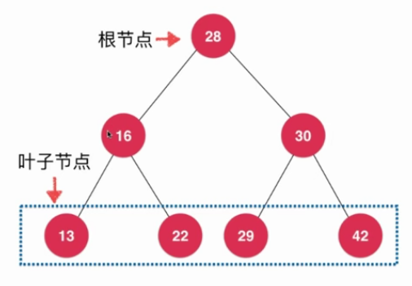
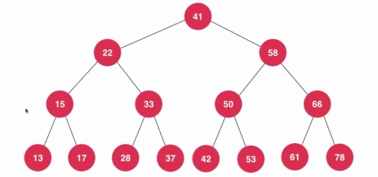
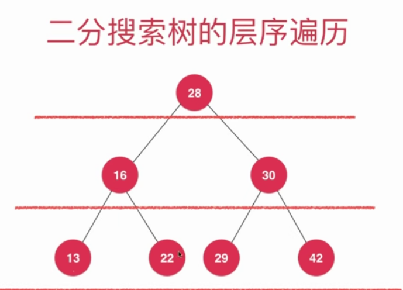
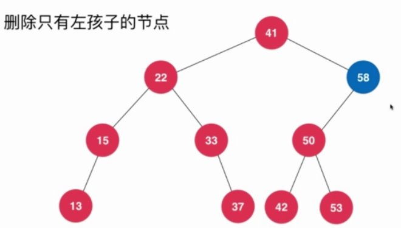
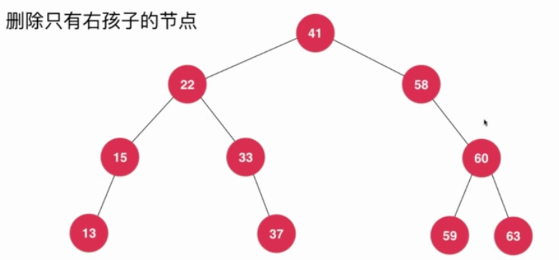

## 二分搜索树

### 为什么要研究树结构？

树结构本身是一种天然的组织结构，如图书馆下面有子馆，家谱，公司组织划分等等。

### 为什么要有树结构？

因为树结构很高效。将数据使用树结构存储后，出奇的高效。

> 数据结构的作用不仅仅是存储数据，更重要的是当使用数据结构存储数据之后可以更高效的使用这些数据。

### 二分搜索树基础

### 二叉树

和链表一样，是动态数据结构。

```java
class Node{
    E e;
    Node left; // 左孩子
    Node right; // 右孩子
}
```

- 二叉树具有唯一的根结点。

- 二叉树每个结点最多有两个孩子。
- 叶子结点的左右两个孩子都为空。
- 二叉树每个结点最多有一个父亲。



- 二叉树也具有天然的递归结构。（每个节点的左子树也是二叉树，每个节点的右子树也是二叉树）。
- 二叉树不一定是“满”的

### 二分搜索树

- 二分搜索树是二叉树。
- 二分搜索树的每个结点值大于其左子树的所有结点值。
- 二分搜索树的每个结点值小于其右子树的所有的结点值。



- 存储的元素必须有可比较性。

#### 向二分搜索树中增加元素

##### 第一种写法

```java
// 向二分搜索树中添加一个元素
    // 分情况：
    //      1、根节点为空
    //      2、根节点不为空
    public void add(E e){
        if (this.root == null){
            root = new Node(e);
            size++;
        }
        else{
            add(this.root, e);
        }
    }

    // 递归地向以node为根节点的二分搜索树中插入元素
    private void add(Node node, E e){
        if (e.equals(node.e)){
            return;
        }
        // 当元素小于根节点且左子树为空
        else if (e.compareTo(node.e) < 0 && node.left == null){
            node.left = new Node(e);
            size++;
            return;
        }
        // 当元素大于根节点且右子树为空
        else if (e.compareTo(node.e) > 0 && node.right == null){
            node.right = new Node(e);
            size++;
            return;
        }

        // 如果不为空，递归地插入到左右子树上
        if (e.compareTo(node.e) < 0){
            add(node.left, e);
        }
        else {
            add(node.right, e);
        }
    }
```

##### 改进后的写法

上述写法是区分了两种情况，根节点是否为空，但其实，根节点为空也可以当作是一颗二分搜索树，所以逻辑应该是，只要元素小于根节点，就递归地插入左子树，只要元素大于根节点，就递归地插入右子树。

```java
// 添加元素（面向用户的接口）
    public void add(E e){
        root = add(root, e);
    }

    // 递归地向以node为根节点的BST中插入元素e
    // 该函数返回的是插入元素e后的二分搜索树的根节点
    private Node add(Node node, E e){
        // 如果node为空
        if (node == null){
            size++;
            // 返回这个节点，才可以连接到原来的BST上
            return new Node(e);
        }

        if (e.compareTo(node.e) < 0){
            node.left = add(node.left, e);
        }
        else if (e.compareTo(node.e) > 0){
            node.right = add(node.right, e);
        }

        // 如果相等，就返回原来的根节点
        return node;
    }
```

#### 二分搜索树的查找

```java
// 在二分搜索树中查找元素
    public boolean isContains(E e){
        return isContains(root, e);
    }

    // 在以node为根节点的BST中查找元素e
    private boolean isContains(Node node, E e){
        if (node == null){
            return false;
        }

        if (e.compareTo(node.e) < 0){
            return isContains(node.left, e);
        }
        else if (e.compareTo(node.e) > 0){
            return isContains(node.right, e);
        }
        // e.compareTo(node.e) == 0
        else {
            return true;
        }
    }
```

#### 二分搜索树的前序遍历

先访问该节点，再访问它的左子树，访问它的右子树，这就是二分搜索树的前序遍历，这是最自然的遍历方式，也是最常用的一种遍历方式。

```java
// 前序遍历以node为根节点的BST
    private void preOrder(Node node){
        // 判断当前的根节点是否为空
        if (node == null){
            return;
        }
        // 递归地遍历左子树
        preOrder(node.left);
        // 递归地遍历右子树
        preOrder(node.right);
    }
```

#### 二分搜索树的中序遍历

只需将访问方式变为，先访问左子树，再访问根节点，再访问右子树就成为了中序遍历。

```java
// 中序遍历以node为根节点的二分搜索树
    private void inOrder(Node node){
        if (node == null){
            return;
        }

        inOrder(node.left);
        System.out.println(node.e);
        inOrder(node.right);
    }
```

#### 二分搜索树的后序遍历

只需将访问方式变为，先访问左子树，再访问右子树，再访问根节点就成为了后序遍历。

```java
// 后序遍历以node为根节点的二分搜索树
    private void postOrder(Node node){
        if (node == null){
            return;
        }

        postOrder(node.left);
        postOrder(node.right);
        System.out.println(node.e);
    }
```

后序遍历的一个应用，为二分搜索树释放内存。

#### 二分搜索树的前序非递归写法

这里使用到了**栈**这种数据结构，用来记录接下来要访问的是哪个节点。

```java
// 二分搜索树的前序遍历的非递归写法
    public void preOrderNR(){
        // 创建一个栈用于存储接下来要访问的节点，类似于系统栈的调用过程
        Stack<Node> stack = new Stack<>();
        // 将根节点压入栈
        stack.push(root);

        while(!stack.isEmpty()){
            // 取出栈顶元素
            Node cur = stack.pop();
            System.out.println(cur.e);
            if (!(cur.right == null)){
                stack.push(cur.right);
            }

            if (!(cur.left == null)){
                stack.push(cur.left);
            }
        }
    }
```

#### 二分搜索树的层序遍历

从第0层开始，一层一层地遍历。



又称为是广度优先的遍历方式。对于广度优先的方式，一般使用非递归的方式处理，要使用队列这一种结构。

```java
// 二分搜索树的层序遍历
    public void levelOrder(){
        Queue<Node> q = new LinkedList<>();
        // 首先将根节点进行入队
        q.add(root);
        // 当队列不为空时
        while (!q.isEmpty()){
            Node cur = q.remove();
            System.out.println(cur.e);
            // 如果有左右孩子，就入队
            if (cur.left != null){
                q.add(cur.left);
            }
            if (cur.right != null){
                q.add(cur.right);
            }
        }
    }
```

##### 广度优先遍历的意义

可以让我们更快地找到问题的解，常用于算法设计中，最短路径。在图中也有深度优先遍历和广度优先遍历。

#### 二分搜索树的删除操作

##### 删除最大值和最小值

为了要删除最大值和最小值，我们就需要首先找到最大值和最小值，根据二分搜索树的定义来看，要找到最大值和最小值也非常容易，因为根节点的左子树的所有节点小于根节点，根节点的右子树的所有节点大于根节点，所以说，要寻找最小值，只需要不断寻找左子树就行，相应的，要寻找最大值，只需要不断寻找右子树就行。

##### 删除任意元素

- 1、删除只有左/右孩子的节点，只需要将其节点删除，再将其子树连接到原来的位置即可。





- 2、删除同时拥有左右孩子的节点：hibbard deletion方法。方法思想：删除节点之后我们要将左右子树合并起来。根据二分搜索树的定义，其左子树所有元素小于它，其右子树的所有元素大于它，我们需要从这些元素中找出一个比它大并且和它最接近的元素代替它的位置（或者找比它小和它最接近的元素），这个元素在哪呢？就是右子树中最小的元素。我们找到这个元素，将原根节点的左右子树和它连接就完成了合并操作。

```java
// 删除以node为根的二分搜索树中值为e的节点，递归算法
    // 返回删除节点后新的二分搜索树的根
    private Node remove(Node node, E e){
        if (node == null){
            // 表示没找到元素
            return null;
        }

        // 如果元素小于根节点，向左子树中删除
        if (e.compareTo(node.e) < 0){
            node.left = remove(node.left, e);
            return node;
        }
        else if(e.compareTo(node.e) > 0){
            node.right = remove(node.right, e);
            return node;
        }
        else{ // e == node.e
            // 左子树为空
            if (node.left == null){
                Node rightNode = node.right;
                node.right = null;
                size --;
                return rightNode;
            }
            // 右子树为空
            if (node.right == null){
                Node leftNode = node.left;
                node.left = null;
                size --;
                return leftNode;
            }
            // 左右子树都不为空
            Node successor = minimum(node.right);
            // 这里进行了size-- 
            successor.right = removeMin(node.right);
            successor.left = node.left;

            node.left = node.right = null;

            return successor;
        }
    }
```

### 二分搜索树的其他一些说明

二分搜索树的顺序性，所有元素都是有序的，中序遍历就是从小到大排列起来，每一个节点都有其前驱节点和后继节点。floor（比某元素小的最大），ceil（比某元素大的最小），rank（在序列中排第几），select（指定序列中的序号，找到某元素）