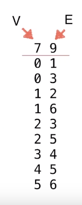

### 图论的应用

- 地理路线。
- 路由路线。
- 互联网连接。
- 论文引用。
- 社交网络。
- 规划方面的应用。

图论是离散数学的一个分支。

### 图的表示

#### 图的分类

图包括**顶点（Vertex）**，**边（Edge）。**

**无向图（Undirected Graph）**，**有向图（Directed Graph）**。

**无权图**，**有权图**。

所以可以分为四类：<u>无向无权图、有向无权图、无向有权图、有向有权图。</u>

#### 图的基本概念（无向无权图）

- *两点相邻*。如果两个点有边相邻，就说这两点相邻。
- *点的邻边*。和这个点相连的所有边。
- *路径Path*。从这张图上的边，可以从一个顶点到达另外一个顶点。
- *环Loop*。从一个点经过多条边又回到这个点，就说环。
- *自环边*。从这个点到这个点。
- *平行边*。可能有时候两个顶点间有两条边。
- *简单图*：没有自环边和平行边的图我们称为简单图。
- *连通分量*：一张图中相互连接，可以互相到达的顶点的集合称为连通分量。一张图不一定所有的顶点都相邻。一个图可能有多个连通分量。
- *有环图，无环图*（树是一种无环图）。
- *连通图的生成树*（包含所有的顶点的树），边数是V-1。只有连通图才有生成树。一个图一定有生成森林。
- *一个顶点的度*（degree）：这个顶点相邻的边数。

#### 图的基本表示：邻接矩阵

设邻接矩阵为A，则`A[i][j] = 1`表示顶点i和顶点j相邻。对于简单图（无自环边和平行边），对于无向图，邻接矩阵沿着主对角线对称。

图的数据表示：（以某一文件格式为例）

第一行第一个数表示顶点数，第二个数表示边的数目，后面的每一行代表一条边。我们需要做的是，读入数据，之后，翻译为邻接矩阵。